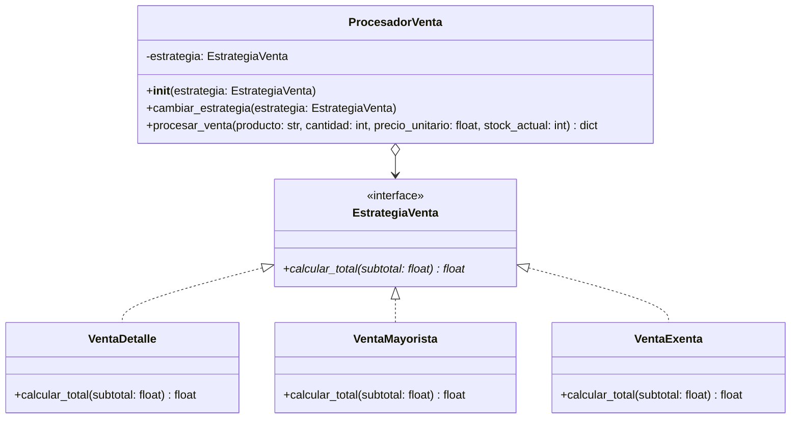

```mermaid
classDiagram
    class ProcesadorVenta {
        -estrategia: EstrategiaVenta
        +__init__(estrategia: EstrategiaVenta)
        +cambiar_estrategia(estrategia: EstrategiaVenta)
        +procesar_venta(producto: str, cantidad: int, precio_unitario: float, stock_actual: int) dict
    }
    class EstrategiaVenta {
        <<interface>>
        +calcular_total(subtotal: float)* float
    }
    class VentaDetalle {
        +calcular_total(subtotal: float) float
    }
    class VentaMayorista {
        +calcular_total(subtotal: float) float
    }
    class VentaExenta {
        +calcular_total(subtotal: float) float
    }
    ProcesadorVenta o--> EstrategiaVenta
    EstrategiaVenta <|.. VentaDetalle
    EstrategiaVenta <|.. VentaMayorista
    EstrategiaVenta <|.. VentaExenta
```
